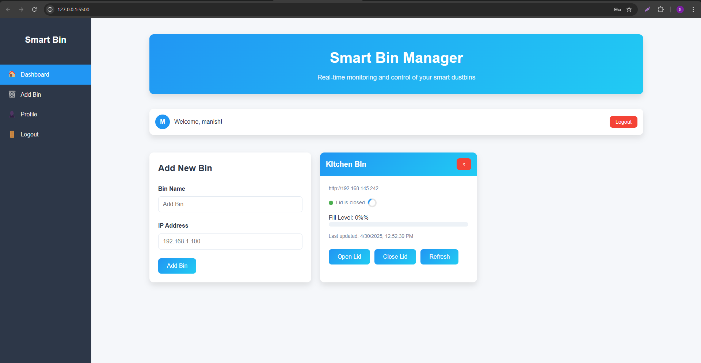
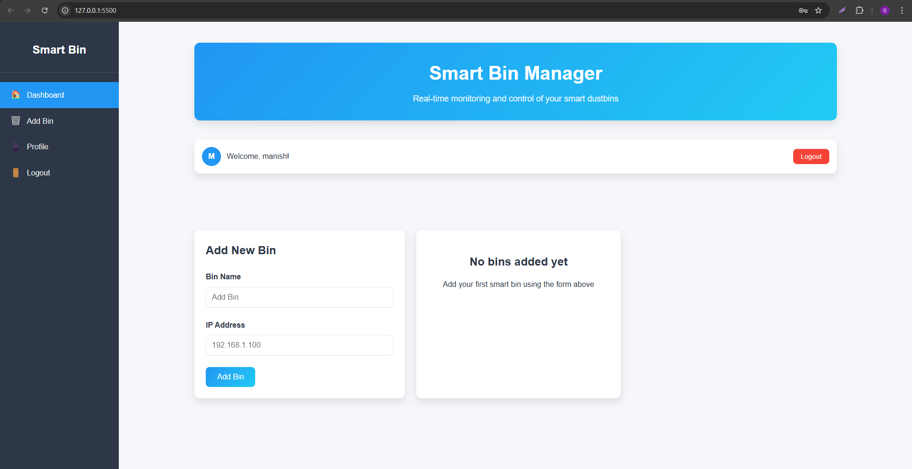
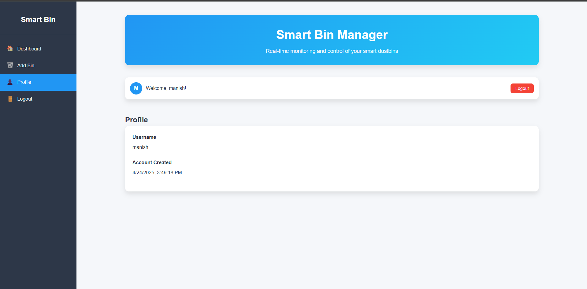
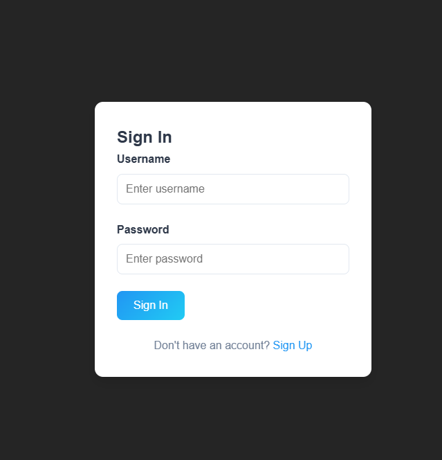

# Smart Dustbin Project

## Overview
This project is a Smart Dustbin Manager using ESP32 to monitor the fill level of a dustbin and manage the lid status. The system is controlled via a web-based dashboard. 

### Features:
- Real-time monitoring of bin fill levels.
- Control lid status (open/close) remotely.
- User authentication (Sign Up / Sign In).
- Alerts for high fill levels (80% and 100%).

## Hardware
- ESP32 Board
- Fill Level Sensor (e.g., ultrasonic or IR)
- Servo Motor (for lid control)

## Software
- Arduino IDE for ESP32
- HTML/CSS/JavaScript for the frontend

## Installation

### Prerequisites:
- Arduino IDE
- ESP32 Board Support
- Wi-Fi network

### Steps:
1. Upload the `smart_dustbin.ino` file to your ESP32 board using Arduino IDE.
2. Modify the Wi-Fi credentials in the Arduino code.
3. Run the frontend (HTML/CSS/JS) in any modern browser.

## Arduino Code
The Arduino code is saved as `smart_dustbin.ino`. This code runs on an ESP32 to interact with the sensors and handle HTTP requests for the web dashboard.

## Images

### Frontend Dashboard Screenshots:

### Frontend Dashboard Screenshots

|  <b>Add Bin</b> |  <b>Dashboard</b> |
|:------------------------------------------------------------:|:----------------------------------------------------------------:|
|  <b>Profile</b> |  <b>Sign In / Sign Up</b> |

## License
This project is licensed under the MIT License.
